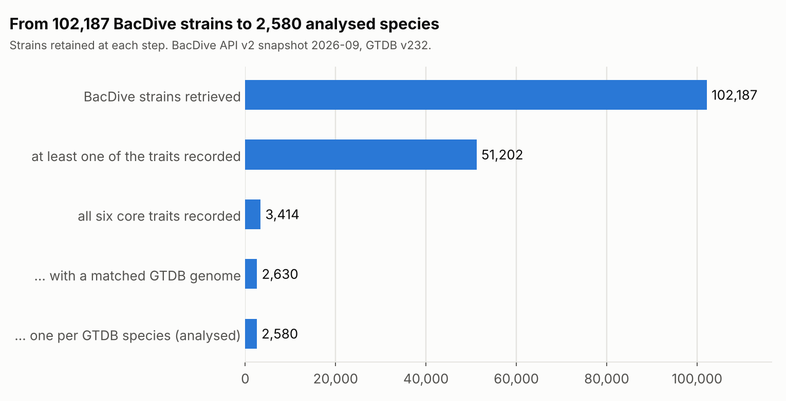
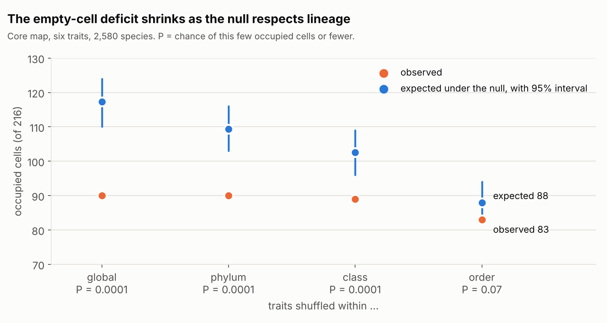
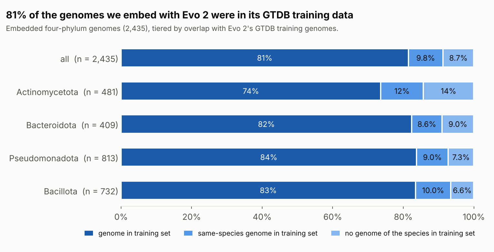
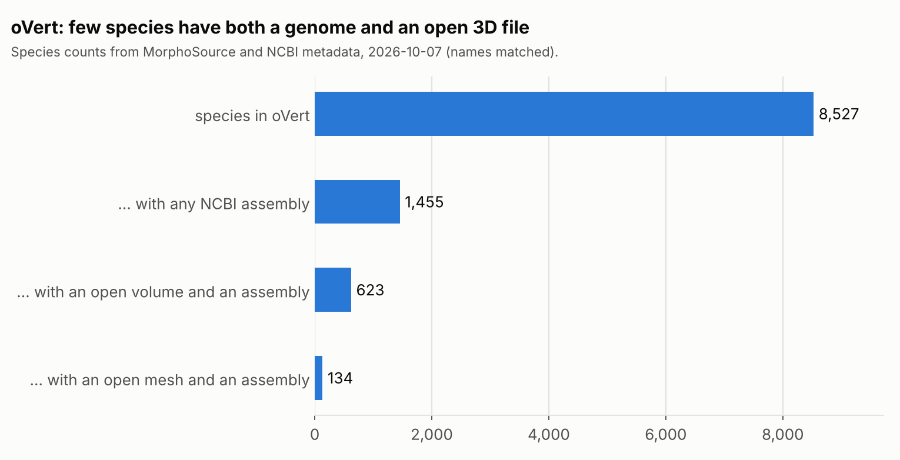

# Slide outline: Biological Possibility Space, first weekly sync

Friday 2026-10-09, 12:00-13:00 EDT. Seven slides, one figure or table each. Figures are in `reports/figures/` and are regenerated
with `python -m src.slide_figures`. The numbers come from committed tables; the source is named under each slide.
Slide 4 is incomplete on purpose: see its note.

---

## 1. The question

**Can a genome model map the possibility space of bacterial traits, or does it only look up relatives?**

| step | what | status |
|---|---|---|
| 1. Occupancy map | Which combinations of six coarse traits exist among sequenced, phenotyped bacteria, and which empty ones are empty beyond what lineage explains? | done |
| 2. Prediction | Does an Evo 2 genome embedding predict traits for clades it has not been trained on? | motility run; other targets supported by the code, results not in the repository |
| 3. Leakage audit | Which controls stop a model from scoring well by looking up nearby relatives, or by having seen the genome in pretraining? | this deck, slide 5 |
| 4. Richer phenotypes | Same questions on continuous morphology (vertebrate CT scans). | scoping only, slide 7 |

*Notes.* "Phylogenetic leakage" means a model scores well on a trait because relatives of the test genome are in its training data, or because traits are laid out along the tree, not because it learned trait biology. Everything after this slide is organised around closing that gap.

---

## 2. Data: BacDive x GTDB, 2,580 species



- **Phenotypes:** BacDive API v2 (snapshot 2026-09). **Genomes:** GTDB v232, matched by accession, then by strain designation. No fuzzy matching.
- **Six coarse traits:** Gram stain, cell shape (rod, coccus, other), motility, spore formation, oxygen tolerance, temperature class.
- **Panel:** one strain per GTDB species, type strain preferred. 2,580 species, 1,235 genera, 24 of the 172 phyla in GTDB v232. 98.8% are type strains.
- **Biases to keep in mind:** culturable, formally described organisms only. Whole uncultured phyla are absent by construction.
- **Embedded with Evo 2 7B (depth 10):** the four large phyla, 2,435 of 2,436 genomes (Pseudomonadota, Bacillota, Actinomycetota, Bacteroidota).

*Source:* `reports/tables/attrition.tsv`, `reports/attrition_report.md`.

---

## 3. Occupancy: empty combinations are explained by lineage



- 90 of 216 cells are occupied. Independent traits would fill about 117 (P = 0.0001).
- The deficit falls from 27 cells to 5 as the null is restricted to within phylum, class and order, and at order level it is not significant (P = 0.07).
- No cell is empty beyond what lineage explains. A second null, independent trait evolution on the GTDB tree, flags 0 cells, but 60 of 72 cells are too rare to test.
- **Limits:** six coarse traits only. A true empty cell is guaranteed to be detected only if about 7 or more species are expected in it.

*Source:* `reports/tables/occupied_vs_expected.tsv`, `reports/evolutionary_null_report.md`, `reports/tables/minimum_detectable_constraint.tsv`.

---

## 4. Evo 2 under leave-one-phylum-out: chance across phyla, and taxonomy does as well as the genome

*Figure pending: it needs `reports/tables/evo2_lopo_motility.json` and `evo2_nearclade_motility.json`, which were written on the machine that ran Modal and are not in the repository. Once they are committed:*

```bash
python -m src.slide_figures --lopo reports/tables/evo2_lopo_motility.json   # writes reports/figures/fig_lopo.png
```

*(The figure code was tested against the output of the repository's own `lopo_evaluate`; the figure shows AUC inside the held-out phylum for Evo 2, whole-genome k-mers, k-mers on Evo 2's windows, and GC, with the 0.5 chance line.)*

- **Test:** hold out one phylum, train on the other three, score AUC inside the held-out phylum. This removes relatives and the phylum-identity shortcut.
- **Result as summarised on 2026-10-01 (numbers to be filled from the JSON, not quoted from memory):** Evo 2 predicts traits within a clade but drops to chance across phyla; taxonomy alone predicts as well as the genome.
- **Near-clade test:** leave-genus-out within a phylum, AUC by taxonomic distance to the nearest training genome, with a taxonomy-prior baseline (prevalence in the nearest shared taxon).

*Source:* `lopo` and `nearclade` entrypoints in `src/evo2_modal.py`; methods in the README.

---

## 5. Phylogenetic leakage: the audit

| control | leakage it closes | status |
|---|---|---|
| Leave-one-phylum-out, scored within the held-out phylum | relatives in training; phylum-identity shortcut | run |
| Leave-genus-out and taxonomy-prior baseline | same-genus near-copies; lookup versus transfer | run |
| Within-phylum and within-order shuffle nulls | models that learned only phylum or order prevalence | run |
| Genus-cluster bootstrap | pseudo-replication: genomes of a genus are near-copies | run |
| In-fold feature selection (Pfam) | label information leaking into feature choice | built, not yet fitted |
| **Pretraining overlap** | Evo 2 saw the genome or a same-species genome | **new, below** |



- **81% of the genomes we embed were in Evo 2's GTDB training data, 91% have a same-species genome in it,** and 8.7% (213 genomes) have no genome of their species in it. No cross-validation control above can close this.
- The OpenGenome2 metadata file lists only the release-220 additions, not the 85,205 release-214.1 base genomes. Using that file alone finds 67 genomes and would wrongly suggest almost none were seen. The base set was rebuilt from GTDB's public release files.
- **Caveats:** only the GTDB part of the training data is checked, not the metagenomes; "unseen" is at species level, and 90% of unseen genomes still have a trained genus.
- **Proposed, not run:** score Evo 2 on the 213 unseen genomes only. Feasible for motility (at least 10 of each class in every phylum), too thin for the other traits.

*Source:* `reports/leakage_audit.md`, `reports/tables/opengenome2_overlap_by_phylum.tsv`, `reports/tables/opengenome2_unseen_feasibility.tsv`.

---

## 6. Pfam annotation as a baseline: in progress

No Pfam result exists yet. Done:
- Whole-genome Pfam annotation of 2,435 of 2,436 genomes, and a matched-window control (Pfam on only the 10 x 8,192 bp windows Evo 2 saw).
- The two-stage in-fold filter, `lopo --pfam` and a `--smoke` run on shuffled labels are implemented and unit-tested.

| open item | owner |
|---|---|
| Choose the single contrast the confirmatory p-values come from (spec section 7), before any Pfam model is fitted to real labels | Avin |
| Smoke run, then motility (primary), then three secondary targets, then the prevalence-threshold check | after the above |

*Source:* `docs/phase2_pfam_spec.md`.

---

## 7. Next: richer phenotypes, and how to block leakage there



- **Candidate source:** oVert on MorphoSource, 17,930 CT media items from 11,304 vertebrate specimens, 8,527 species. Metadata is open through an API, but only 52.6% of items are open download.
- **Genomes:** 1,455 species (17%) have any NCBI assembly. Only 134 have both an open mesh and an assembly (623 with an open CT volume).
- **Leakage blocks that carry over:** hold out whole orders or classes; compare with a nearest-relative baseline on a time-calibrated tree; Brownian-motion null; cluster by species.
- **New for vertebrates:** scan and collection batch confounded with taxon, and about half the genome-bearing species appear in Evo 2's training list. The Evo 2 window design (82 kb of a 4 Mb genome) would sample under 0.01% of a vertebrate genome.

**For discussion**
1. Which morphology traits matter: shape of one structure, or whole-body proportions?
2. Start with the 134 open-mesh species that have a genome?
3. Should a vertebrate arm use Evo 2 at all, given the sampling and pretraining points?

*Source:* `docs/overt_scoping.md`, `reports/tables/overt_genome_coverage.tsv`.
